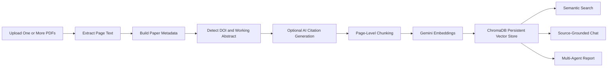

# PaperMind

PaperMind is a Streamlit-based research workspace for analyzing academic PDFs with multi-agent AI and retrieval-augmented generation.

It supports uploading one or many papers, extracting readable text, generating working citations and DOI metadata, storing chunks in a persistent ChromaDB vector database, searching across uploaded PDFs, chatting with source-grounded answers, and exporting a structured research report.

Built as a capstone project for the Google x Kaggle AI Agents Intensive: Vibe Coding Course 2026.

---

## Current Features

- Command-bar research workspace with popovers and focused tabs
- Multi-PDF upload and management
- Automatic PDF text extraction with page-level chunking
- First 500 words saved as a working abstract for each paper
- DOI detection from extracted text
- Optional AI-generated citation records
- Persistent ChromaDB vector storage in `.papermind_chroma/`
- Gemini embedding-based semantic retrieval with model fallback
- Source-grounded chat with paper/page citations such as `[Paper 1, p. 4]`
- Context health indicators for active papers, pages, words, vector count, and coverage
- Per-paper removal from active context and vector store
- Six-agent report workflow for summary, methodology, evaluation, claims, mentor notes, and safety review
- Markdown and PDF report export
- Streamlit popovers for upload, context health, settings, and session actions
- Dark-mode-safe Streamlit styling

---

## Interface

The app uses a compact command-bar layout with popovers and tabs.

Command bar popovers:

| Popover | Purpose |
| --- | --- |
| Upload PDFs | Select one or more PDFs and run extraction/indexing. |
| Context Health | Check ChromaDB status, active papers, readable pages, vector count, and coverage. |
| Workflow Settings | Review the active Gemini model, context depth, RAG source count, and citation mode. |
| Session Actions | Clear chat, report output, or active paper context. |

Main workspace tabs:

| Tab | Purpose |
| --- | --- |
| Library | View the active paper library, per-paper details, top terms, and optional extracted text. |
| Search & Chat | Run semantic search and ask source-grounded questions over indexed PDFs. |
| Report Studio | Generate and export the multi-agent research report. |

---

## RAG Workflow



---

## Agent System

| Agent | Purpose |
| --- | --- |
| Summary Agent | Summarizes the research problem, objective, method, findings, and contribution. |
| Methodology Agent | Extracts datasets, preprocessing, algorithms, tools, and experimental setup. |
| Evaluation Agent | Reviews metrics, baselines, results, comparisons, and limitations. |
| Claims Evidence Agent | Lists important claims and assesses support strength. |
| Research Mentor Agent | Suggests research gaps, improvements, future experiments, and practical ideas. |
| Safety Review Agent | Flags unsupported claims, unsafe wording, overstatements, and missing review notes. |

Agent prompt instructions live in `skills/` and are loaded by the Python agent wrappers.

---

## Technology Stack

| Layer | Tool |
| --- | --- |
| App UI | Streamlit |
| Language | Python |
| LLM provider | Google Gemini API |
| Embeddings | Gemini embedding API, default fallback `embedding-001` |
| Vector database | ChromaDB |
| PDF extraction | pypdf |
| PDF export | ReportLab |
| Environment config | python-dotenv |

---

## Project Structure

```text
PaperMind/
├── agents/
│   ├── common.py
│   ├── summary_agent.py
│   ├── methodology_agent.py
│   ├── evaluation_agent.py
│   ├── claims_agent.py
│   ├── research_mentor_agent.py
│   ├── safety_agent.py
│   └── report_agent.py
├── skills/
│   ├── summary_skill.md
│   ├── methodology_skill.md
│   ├── evaluation_skill.md
│   ├── claims_skill.md
│   ├── research_mentor_skill.md
│   └── safety_skill.md
├── utils/
│   ├── gemini_client.py
│   ├── pdf_reader.py
│   └── rag_store.py
├── app.py
├── requirements.txt
├── .gitignore
└── README.md
```

Runtime-generated local data:

```text
.papermind_chroma/   # persistent ChromaDB vector store, ignored by git
.env                 # local API key, ignored by git
```

---

## Installation

Clone the repository:

```bash
git clone https://github.com/darkdevil3610/PaperMind.git
cd PaperMind
```

Create and activate a virtual environment:

```bash
python -m venv .venv
source .venv/bin/activate
```

Install dependencies:

```bash
pip install -r requirements.txt
```

Create a `.env` file:

```env
GEMINI_API_KEY=YOUR_GEMINI_API_KEY
# Optional fallback override if your API key does not support the auto-selected embedding model:
GEMINI_EMBEDDING_MODEL=embedding-001
```

Run the app:

```bash
streamlit run app.py
```

---

## How To Use

1. Open the Streamlit app.
2. Choose the Gemini model, context depth, and number of RAG sources from the sidebar.
3. Upload one or more text-based PDF papers.
4. Open the `Upload PDFs` popover and click `Extract and index`.
5. Review active papers and remove any document you do not want in context.
6. Use semantic search to inspect relevant source chunks.
7. Ask questions in chat and review cited answers.
8. Generate the multi-agent report.
9. Export the final report as Markdown or PDF.

---

## Notes on Multi-PDF RAG

When multiple PDFs are uploaded, PaperMind:

- Extracts each file independently
- Labels sources as `Paper 1`, `Paper 2`, and so on
- Chunks text by page for better source attribution
- Stores vectors persistently in ChromaDB
- Retrieves the most relevant chunks for each query
- Prompts the AI to cite sources with paper/page labels

This makes the app useful for early literature review, paper comparison, and project planning.

---

## Current Limitations

- Scanned image-only PDFs require OCR, which is not currently included.
- AI-generated citations depend on available metadata and should be verified.
- Citation verification against external databases is not implemented yet.
- Very large paper libraries can consume embedding API quota during indexing.
- AI-generated answers and reports still require human review.
- If indexing fails with a Gemini embedding model error, set `GEMINI_EMBEDDING_MODEL=embedding-001` in `.env`.

---

## Troubleshooting

### Gemini embedding model not found

If indexing fails with an error like:

```text
404 models/text-embedding-004 is not found or is not supported for embedContent
```

Add this to `.env` and restart Streamlit:

```env
GEMINI_EMBEDDING_MODEL=embedding-001
```

The app also attempts to auto-detect supported embedding models.

### ChromaDB RustBindings error

If startup or indexing fails with:

```text
AttributeError: 'RustBindingsAPI' object has no attribute 'bindings'
```

Try recreating the local environment and vector store:

```bash
rm -rf .venv .papermind_chroma
python -m venv .venv
source .venv/bin/activate
pip install -r requirements.txt
streamlit run app.py
```

This error usually comes from an incompatible or corrupted local ChromaDB install/cache.

---

## Future Enhancements

- OCR support for scanned PDFs
- Cross-paper comparison matrix
- Citation verification with Crossref, PubMed, or Semantic Scholar
- Saved named projects and context libraries
- Export RAG chat transcripts
- Better DOI metadata enrichment
- Migration to the latest Gemini SDK

---

## Author

**Gourav Suresh**  
BCA student, Kerala University

GitHub: https://github.com/darkdevil3610

---

## License

This project is released under the MIT License.
